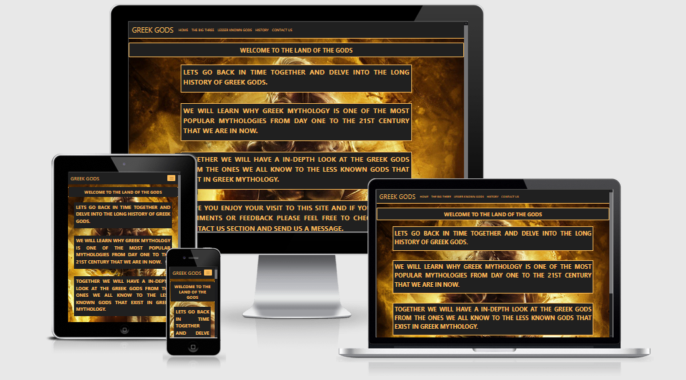
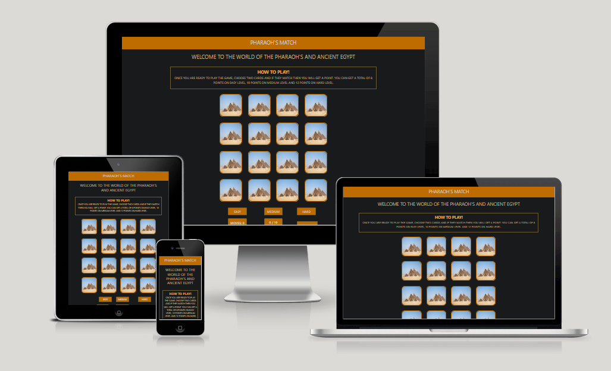
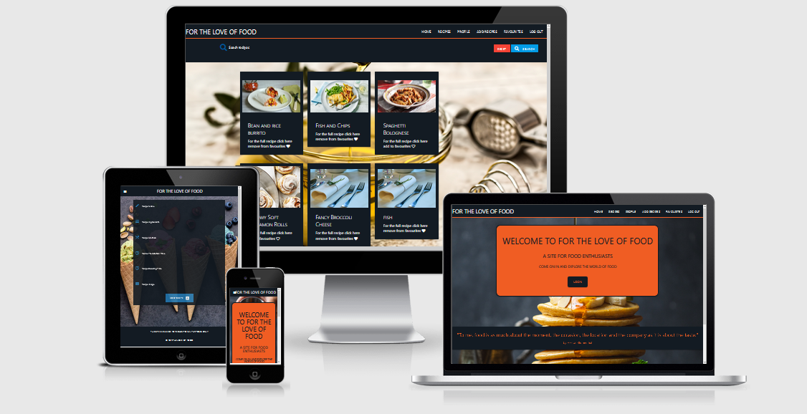
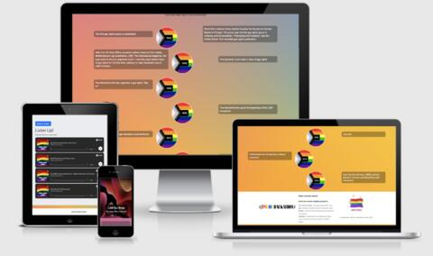
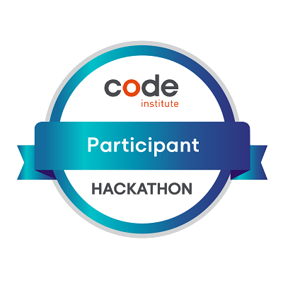
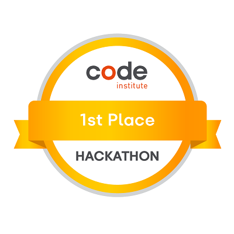
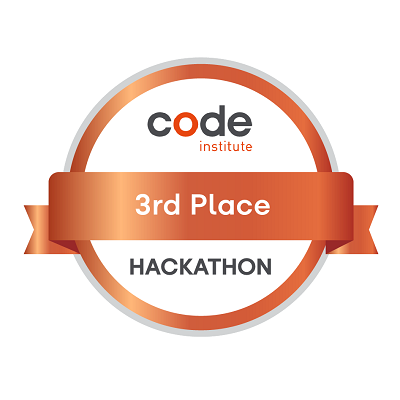

# Emanuel Silva, Junior Software Developer

# About Me

Welcome to my profile page,

I'm Emanuel, Currently a Metroline Bus Driver in London.

Having completed a Full Stack Software Developer course from [Code Institute](https://codeinstitute.net/), and was awarded a pass. I am now on the search for my first job in the tech industry as a Junior Developer.

### My Tech Stack 

#### **Frontend**

    

#### **Backend**

    

#### **Database**

  

#### **Version Control**

 

#### **Development and Deployment**

     

---

#### **Learning in progress**

---

#### **Future Learning**

---

## GitHub Statistics

## GitHub Trophies

# Milestone Projects

As part of the [Code Institute](https://codeinstitute.net/)'s Full Stack Software Development Course. I was asked to create four projects.

|  Milestone Project       | Project | Grade  |
| :----------------------: | :----------------------: | :---: |
|  My first milestone project was built using HTML, CSS and Bootstrap. I created a website based on Greek Mythology, designed to give detailed information and history about the Greek Gods. |  | Pass  |
|  My second milestone project was built using HTML, CSS, JavaScript and Bootstrap. I created a website card matching game with a theme based on Ancient Egypt. |  | Pass  |
|  My third milestone project was built using HTML, CSS, JavaScript, Python and Materialize CSS. I created a food recipe website that allows you to view, add, edit and delete your own recipes |  | Pass  |
|  My fourth and final project while studying at Code Institute, this project was created using HTML5, CSS3, JavaScript, Python, Django and Bootstrap5. Where I created an e-commerce website that allows you to purchase Dinosaurs, while also being to add, edit and delete your own Dinosaur. |  | Merit  |

# Hackathon Projects

| Date and Theme  | Project | Results  |
| :-------------: | :----------------------: | :---: |
|
A site to detail the history of the LGBTQ+ movement, made by team M8 in the Code Institute June 2021 Hackathon, with a theme of Proud Coders, which was built using HTML, CSS, JavaScript and Bootstrap.
 |  |   |

## Code Institute Badges

 

## CodeWars Profile

## Contact me

