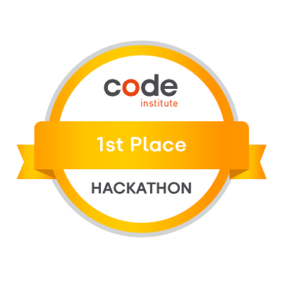

# Emanuel Silva, Junior Software Developer

    

# About Me

Welcome to my profile page.

I'm Emanuel, currently a Metroline Bus Driver in London.

Having completed a Full Stack Software Developer course from [Code Institute](https://codeinstitute.net/) on 14th February 2022 and was awarded a pass, I am now on the search for my first job in the tech industry as a Junior Developer.

I have always been interested in learning code and love learning new skills. Prior to commencing the Full Stack Software Developer course in January 2021, I had done some coding a few years back, which consisted of just some basic HTML and CSS. In 2021, I enrolled in the 5 day coding challenge with [Code Institute](https://codeinstitute.net/) and loved every single moment of it, it was then that I decided it was time for a career change.

# My Tech Stack 

### **Frontend**

    

### **Backend**

      

### **Database**

  

### **Version Control**

 

### **Development and Deployment**

     

### **Learning in progress**

---

### **Future Learning**

---
    

## GitHub Statistics

|       |  |
| :----------------------: | :---: |
|  |   |

<!--  -->

<!--  -->

## GitHub Trophies

# Milestone Projects

As part of the [Code Institute](https://codeinstitute.net/)'s Full Stack Software Development Course. I was required to create four projects:

|  Milestone Project       | Project | Grade  |
| :----------------------: | :----------------------: | :---: |
|  My first milestone project was built using HTML, CSS and Bootstrap. I created a website based on Greek Mythology, designed to give detailed information and history about the Greek Gods. |  | Pass  |
|  My second milestone project was built using HTML, CSS, JavaScript and Bootstrap. I created a website card matching game with a theme based on Ancient Egypt. |  | Pass  |
|  My third milestone project was built using HTML, CSS, JavaScript, Python and Materialize CSS. I created a food recipe website using CRUD functionality that allows you to view, add, edit and delete your own recipes. |  | Pass  |
|  My fourth and final project was created using HTML5, CSS3, JavaScript, Python, Django and Bootstrap5. Where I created an e-commerce website that allows you to purchase dinosaurs, while also being able to add, edit and delete your own dinosaur. |  | Merit  |

# Hackathon Projects

[Code Institute](https://codeinstitute.net/) have monthly hackathon projects where I am working with a small group of fellow developers to produce a themed project in 5 days.

Communication is the key to success while doing these projects. We work collaboratively within an agile environment and use sprints to successfully complete the project in time. Please see below for more information regarding my contribution to theses hackathons.

| Date and Team Name | Project | Results  |
| :-------------: | :----------------------: | :---: |
| 
Made by team Santa's lil' hackers in the [Code Institute](https://codeinstitute.net/)'s December 2021 Hackathon
 
Built using HTML, CSS and JavaScript.
 |  
A advent calendar style website, where the user would have to solve a code related challenge in which they would receive a special reward upon successful completion of the challenge.
 | |
| 
Made by team DD-AA in the [Code Institute](https://codeinstitute.net/)'s November 2021 Hackathon
 
Built using HTML, CSS and JavaScript..
 |  
A website on up-and-coming technologies for early breast cancer screening, while raising breast cancer awareness
 | |
| 
Made by team 1-Bit Short of a Flappy Disk in the [Code Institute](https://codeinstitute.net/)'s August 2021 Hackathon
 
Built using HTML, CSS and JavaScript..
 |  
A side-scrolling game with the character Tux, the Linux mascot.
 | |
| 
Made by team M8 in the [Code Institute](https://codeinstitute.net/)'s June 2021 Hackathon
 
Built using HTML, CSS, JavaScript and Bootstrap.
 |  
A site to detail the history of the LGBTQ+ movement, with a theme of Proud Coders
 | |

## CodeWars Profile

## Contact me

## Visitor count

